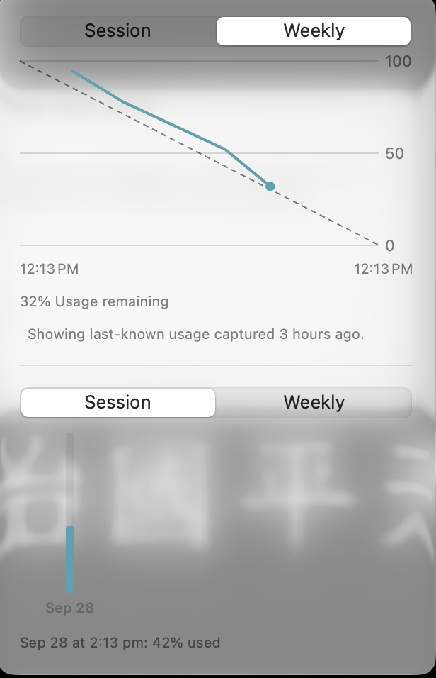
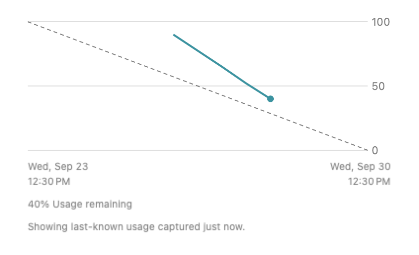

# Quota burndown proof

The debug app has an opt-in synthetic fixture for the production Plan Usage submenu:

```sh
CODEXBAR_SIGNING=adhoc ./Scripts/package_app.sh debug
open -n CodexBar.app --args --quota-burndown-proof
```

Choose **Open Plan Usage**, then **Weekly** in the upper chart. The submenu uses the
same lazy hydration and hosted views as the normal menu. It shows the recorded
burndown, its capture age, and the original utilization chart below a separator.
Weekly endpoints include localized weekday, month, date, and time. Session endpoints
remain compact time labels.

The fixture runs before normal startup, disables Keychain access and background
refresh, and stores its synthetic configuration in a unique temporary directory.
It does not contact providers or load real accounts. **Toggle older captures**
exercises the last-known label without supplying a live snapshot.

The native submenu below was captured from the running synthetic fixture. It shows
both charts and the capture-age label, before the calendar-label follow-up.



A separate rendering fixture produces the calendar-label screenshot:

```sh
CODEXBAR_BURNDOWN_PROOF_PATH=/tmp/codexbar-weekly-calendar-proof.png \
CODEXBAR_BURNDOWN_PROOF_WEEKLY=1 \
swift test --filter QuotaBurndownRenderProofTests
```



This image is a hosted-view render. Native submenu verification also confirmed both
charts and the weekly endpoint labels in the running debug app's accessibility tree.
